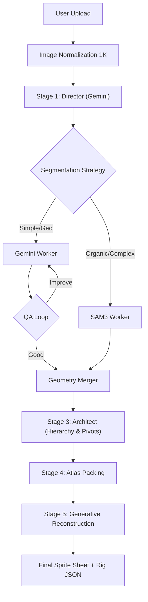

# Neural Sprite Pipeline
**Automated Decomposition & Reconstruction for 2D Rigged Game Assets**
*Technical Report v3.0 • Hybrid Segmentation Architecture*

## Abstract

This paper introduces the **Neural Sprite Pipeline (N-Sprite)**, an automated workflow for converting static 2D concept art into rigged, articulated game assets. By leveraging a **Sequential Multi-Persona Workflow**, the system dynamically selects the optimal segmentation strategy—combining the reasoning capabilities of Multimodal Large Language Models (MLLMs) with the precision of specialized segmentation models like SAM3.

The pipeline deconstructs single-view images into logically segmented "Rigid Bodies," reconstructs occluded areas using generative in-painting, and builds automated kinematic rigs. The v3.0 implementation integrates Google's Gemini 3 Flash model for semantic reasoning and Fal.ai's SAM3 for high-fidelity mask generation, orchestrated by a central Director module.

---

## I. Methodology

### A. Image Normalization
Input images are pre-processed to ensure a consistent coordinate space:
- **Resizing**: Images are scaled to fit a 1024×1024 pixel canvas.
- **Padding**: White background padding is applied to maintain aspect ratio.
- **Centering**: The subject is centered to maximize resolution for small details.

### B. Stage 1: The Director (Semantic Decomposition)
The **Director** performing the initial high-level analysis. It does not generate pixel-perfect masks but instead acts as a strategist.
- **Input**: Normalized Image.
- **Task**: Identify functional sub-components (e.g., "Left Upper Arm," "Wheel Hub").
- **Output**: A `PartManifest` containing:
    - `id`, `name`, `type_hint` (e.g., LIMB, WHEEL).
    - `visual_anchor` (center point).
    - `approximate_bbox`.
    - **`segmentation_strategy`**: Critical decision logic.
        - **`gemini`**: Selected for simple geometric shapes (circles, rectangles, boxy joints).
        - **`sam3`**: Selected for complex, organic, or irregular shapes (hair, cloth, muscles).

### C. Stage 2: Hybrid Worker Layer
The system executes a parallelized extraction phase based on the Director's assignments:

#### 1. Gemini Workers (Geometric & Simple)
For simple parts, a specialized Gemini Worker is spawned.
- **Self-Reflection Loop**:
    1.  **Generate**: Propose an SVG primitive (Circle, Rect, Ellipse, Path).
    2.  **Composite**: Overlay the proposed shape on the original image.
    3.  **Evaluate**: A separate "QA Persona" reviews the composite.
        - If `VERDICT: GOOD` → Commit.
        - If `VERDICT: IMPROVE` → Loop back with specific feedback (e.g., "Widen the radius by 10%").

#### 2. SAM3 Workers (Organic & Complex)
For complex parts, the system calls the Segment Anything Model 3 (SAM3) via high-speed API (Fal.ai).
- **Process**:
    - The Director's bounding box is passed as a prompt to SAM3.
    - SAM3 returns a high-fidelity pixel mask.
    - **Vectorization**: The mask is converted to an SVG path using standard tracing algorithms.

### D. Stage 3: The Architect (Kinematics)
Once all geometries are extracted, the **Architect** constructs the scene graph.
- **Input**: List of defined parts with finalized geometries.
- **Task**:
    1.  **Hierarchy**: Build a parent-child tree (e.g., Hand → Lower Arm → Upper Arm → Torso).
    2.  **Pivots**: Identify mechanical pivot points for rotation.
    3.  **Physics**: Assign movement types (ROTATION, SLIDING, FIXED, ELASTIC).

### E. Stage 4: Atlas Layout Optimization
A deterministic packing algorithm organizes the extracted parts into a texture atlas (Sprite Sheet).
- **Algorithms**: `MaxRects` (default), `Row`, or `Grid` packing.
- **Output**: A transform map linking original image coordinates to atlas coordinates.

### F. Stage 5: Generative Reconstruction
The final phase fills in the texture data for each part.
- **Problem**: When a part is extracted, the area "behind" it (in the original image) is unknown. When the sprite rotates, these occluded areas become visible.
- **Solution**: A dual-input generative process.
    - **Prompt**: "Reconstruct the [Part Name] in the [Target Box], filling in occluded areas."
    - **Models**:
        - **Gemini 1.5 Pro**: Follows complex spatial instructions well.
        - **Flux (via Fal.ai)**: High-fidelity texture generation, useful for artistic consistency.

---

## II. System Architecture



## III. Data Structures

The pipeline relies on a unified `GamePart` schema:

```typescript
interface GamePart {
  id: string;
  name: string;
  parentId: string | null;     // Heirarchy
  shape: SVGPrimitive;         // Vector path/primitive
  bbox: number[];              // [min_x, min_y, max_x, max_y]
  pivot: { x: number; y: number }; // Rotation point
  movementType: MovementType;  // Physics behavior
  origin: {                    // Original coordinates
    x: number; y: number; width: number; height: number;
    rotation?: number;
  };
  atlasRect?: {                // Atlas coordinates
    x: number; y: number; w: number; h: number;
  };
}
```

## IV. Future Work

1.  **Multi-View Consistency**: Generating side and back views from the single frontal input.
2.  **3D Projection**: Mapping the 2D sprites onto low-poly 3D meshes for "2.5D" effects.
3.  **Automated Animation**: Using the rigging data to auto-generate walk cycles and idle animations.
